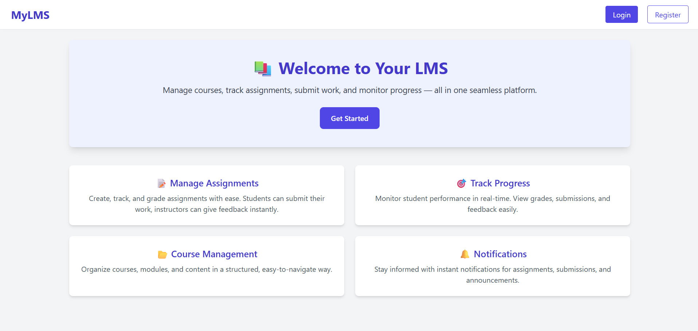
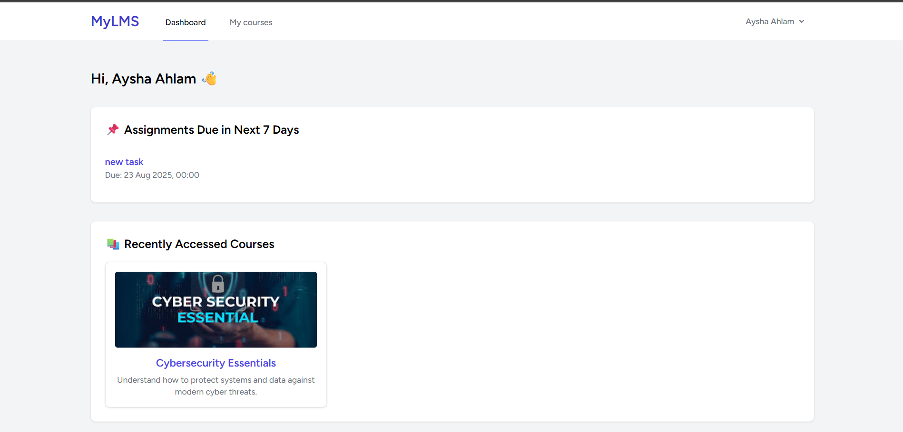
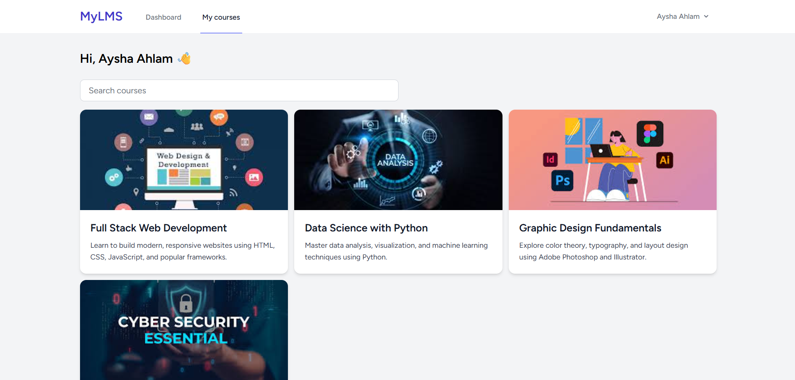
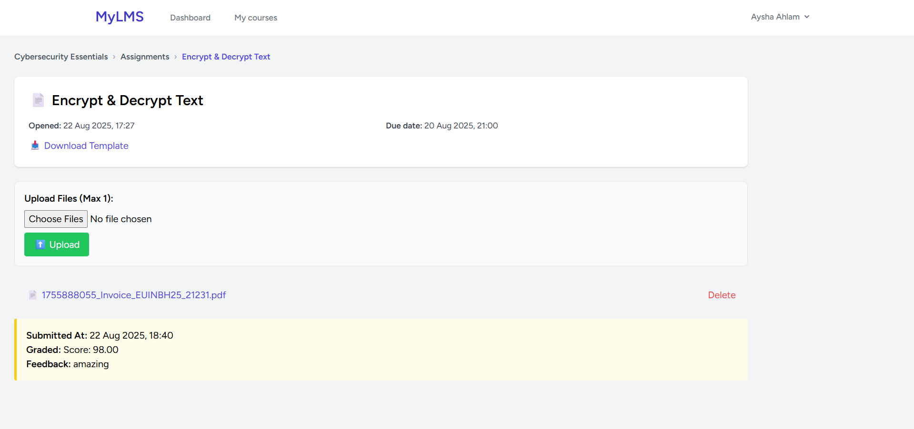
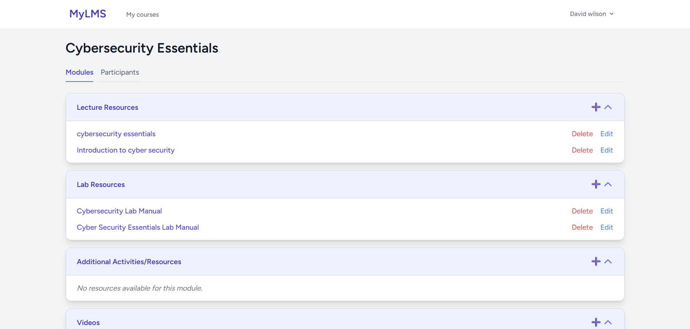
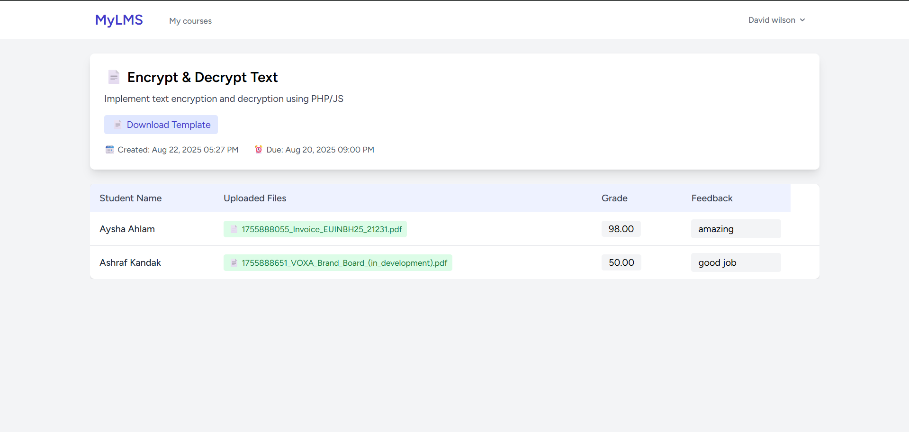

# LMS Project

A **Learning Management System (LMS)** built with **Laravel** that allows students and instructors to manage courses, assignments, and grades efficiently.

Students can view dashboards, upcoming assignments, access course materials, upload assignments, and instructors can grade submissions. Authentication supports **Email**, **Google**, and **GitHub** login.

---

## Table of Contents

- [Features](#features)
- [Screenshots](#screenshots)
- [Installation](#installation)
- [Environment Setup](#environment-setup)
- [Database Migrations](#database-migrations)
- [Usage](#usage)
- [Authentication](#authentication)
- [Course Registration](#course-registration)
- [Profile Management](#profile-management)
- [License](#license)

---

## Features

### Student Dashboard

- Calendar view of assignment due dates
- List of upcoming assignments (next 7 days)
- Recently accessed courses

### Courses

- View courses the student is enrolled in
- Click on a course to access modules and resources (PDF, videos, links)
- Upload assignment submissions

### Assignments

- Students can view assignment details, due dates, and submit files
- Instructors can view submissions, provide grades and feedback

### Authentication

- Login via **Email**
- Social login: **Google** and **GitHub**

### Course Registration

- Students select **4–6 courses** during registration

### Profile Management

- Update **name**, **email**, and **password**
- Delete account

---

### Screenshots


### Screenshots



## Student view





## Instructor view




---

## Installation

1. Clone the repository:

```bash
git clone https://github.com/yourusername/lms.git
cd lms
```

2. Install dependencies:

```bash
composer install
npm install
npm run build
```

3. Copy `.env.example` to `.env` and configure your environment variables


---

## Database Migrations

Run migrations to create tables:

```bash
php artisan migrate
```

Seed data (optional):

```bash
php artisan db:seed
```

---

## Usage

- Start the local server:

```bash
php artisan serve
```

- Open `http://localhost:8000` in your browser
- Access dashboard, courses, assignments, and profile management

---

## Authentication

- Email/password login
- Google login
- GitHub login

---

## Course Registration

- Students must select **minimum 4** and **maximum 6** courses
- The selection is saved in the `course_user` pivot table

---

## Profile Management

- Update **name** and **email**
- Change password
- Delete account


---

## License

This project is licensed under the **MIT License**.

